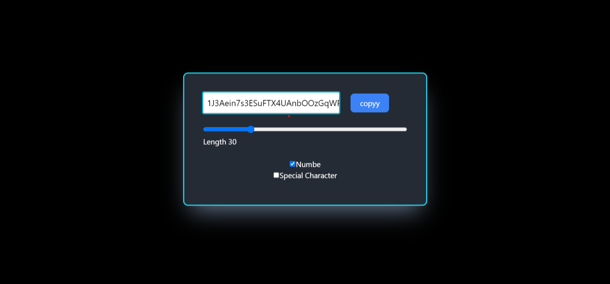

# Random Password Generator

## Overview

Random Password Generator is a simple React component that generates random passwords with customizable length and character sets. This component provides an easy-to-use interface for generating secure passwords for your applications.

## Technologies Used

- React.js
- JavaScript (ES6+)

## Installation

To use this component in your React project, you can follow these steps:

1. Clone the repository to your local machine:

```bash
git clone https://github.com/SandhanMeher/random-password.git

cd random-password

npm install
# or
yarn install
``````

